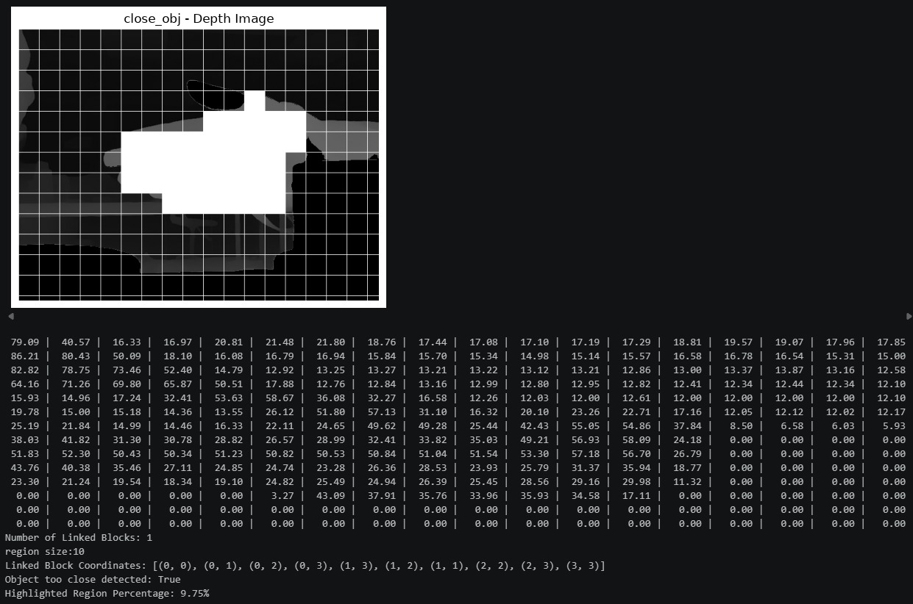

# Depth-Anything AUV Navigation Module

This project was developed for the team **[Manta Ray](https://www.polyu.edu.hk/engineeringentrepreneurshipclub/competitions/international-competition-sauvc/)** as a visual navigation module of our Autonomous Underwater Vehicle (AUV) in [SAUVC](https://sauvc.org/) 2025.

Powered by **Apple CoreML** for high-performance on-device processing, this module transforms camera feeds into real-time depth estimations. It serves as a software-based depth sensor, specifically designed to detect approaching obstacles and let the AUV to dodge the object automatically.

## Implementation

The finalized detection logic is located in **`main.py`** at the root of the project. For the sample outputs, you may view the cell 1 from **`src/depth_approaches.ipynb`**.

### The Algorithm: Block-Based Surface Detection
The core detection mechanism relies on region-based evaluation to identify structurally coherent, close objects while ignoring background noises.

#### Rationale & How It Works:
Instead of relying on a naive global difference or simplistic hard pixel-thresholds (which often fail due to localized reflections, sensor noise, or partial object overlap), the logic utilizes a block-clustering approach:

1. **Noise Reduction & Specular Masking:** Depth estimation models can occasionally output localized "infinite" or over-bright spots at edges. The algorithm explicitly masks out exceptionally bright outliers to prevent small artifacts from triggering false positives.
2. **Block Subdivision:** The depth image is subdivided into a uniform grid (blocks). By calculating the mean depth intensity per block, pixel-level jitter is smoothed out.
3. **Region Growing (Flood-Fill/DFS):** Neighboring blocks are algorithmically linked if they share similarly high mean depth intensities (within a localized tolerance). 
4. **Surface Size Thresholding:** A cluster of contiguous blocks is flagged as a true "close surface" or "approaching object" only if the linked region size meets a minimum block count threshold. This successfully filters out isolated noise and demands physical volume for a detection.

## Requirements & Installation

This project is managed using the [uv](https://github.com/astral-sh/uv) package manager. To set up the virtual environment and install all necessary dependencies, simply run:

```bash
uv sync
```

Run the script by:

```bash
uv run main.py
```

### Using Jupyter Notebooks
To run the provided Jupyter notebooks (e.g., `src/depth_approaches.ipynb`) using the `uv` environment:

1. Add `ipykernel` to your development dependencies if you haven't already:
   ```bash
   uv add --dev ipykernel
   ```
2. **In VS Code:** Open the notebook, click on the Kernel selector (top right), choose "Python Environments", and select the Python interpreter from the `.venv` directory created by `uv`.
3. **Via CLI:** You can start a Jupyter server directly from the environment by adding `jupyter` and running:
   ```bash
   uv add --dev jupyter
   uv run jupyter notebook
   ```

## Model

This project uses the `Depth-Anything-V2-Small-hf` model from the `transformers` library for monocular depth estimation. You can find the model on [Hugging Face](https://huggingface.co/depth-anything/Depth-Anything-V2-Small-hf).

## Sample Output

Here are some examples of the output generated by the scripts:

### Depth Map Example


### Approach Detection Example


