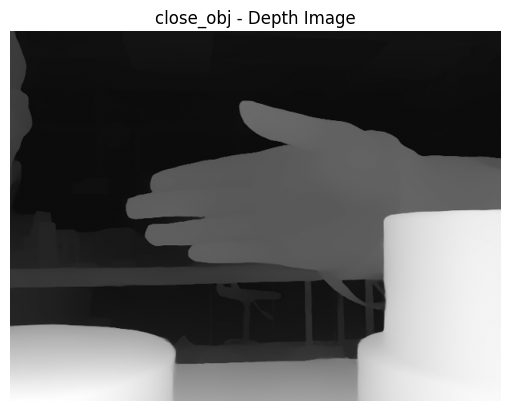
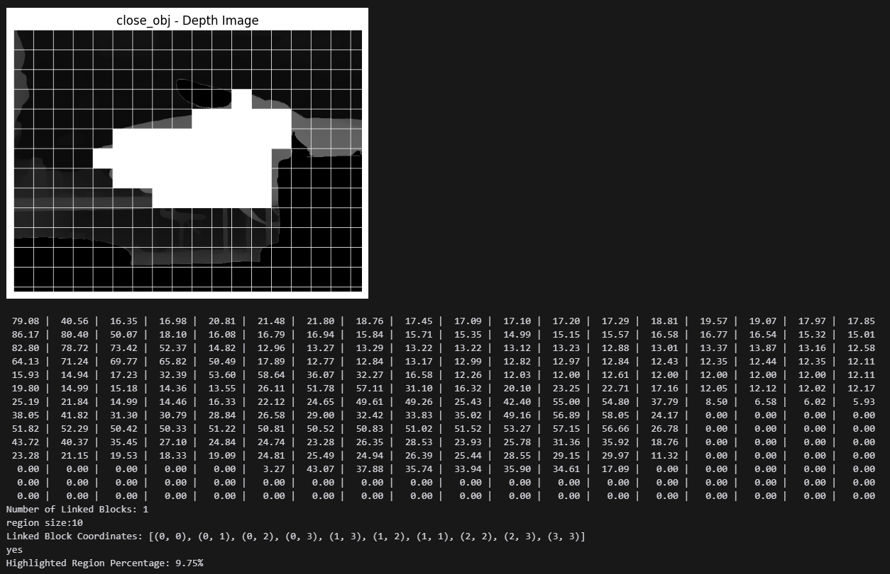

# Depth-Based Approach Detection

This project uses a depth estimation model to detect objects approaching the camera based on changes in depth map brightness.

## Requirements

The following libraries are required to run the script:

- `transformers`
- `torch`
- `numpy`
- `Pillow`
- `opencv-python`
- `matplotlib`

## Installation

Install the required libraries using pip:

```bash
pip install transformers torch numpy Pillow opencv-python matplotlib
```
## Core Logic

1. The script captures an initial frame after a specified time (`capture_time`).
2. It processes the frame using a depth estimation model to generate a depth map.
3. Subsequent frames are compared to the initial frame at regular intervals (`compare_time`).
4. If the average brightness difference exceeds a threshold, an approach is detected.

## Configurable Parameters

- `capture_time`: Time in seconds to wait before capturing the initial frame.
- `compare_time`: Time interval in seconds for comparing frames.
- `threshold`: Brightness difference threshold for detecting an approach.

## Model

This project uses the `Depth-Anything-V2-Small-hf` model from the `transformers` library for depth estimation. You can find the model on [Hugging Face](https://huggingface.co/).

## Sample Output

Here are some examples of the output generated by the script:

### Depth Map Example


### Approach Detection Example
